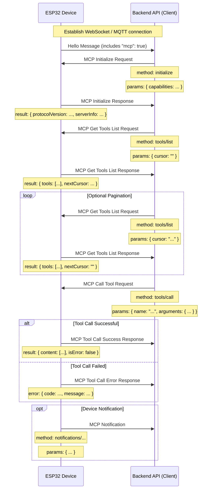

# MCP (Model Context Protocol) Interaction Flow

NOTICE: AI-assisted draft. When implementing backend services, verify details against the code.

In this project, the MCP protocol is used for communication between the backend API (MCP client) and ESP32 devices (MCP server), so the backend can discover and invoke device-provided capabilities (tools).

## Protocol Format

According to the code (`main/protocols/protocol.cc`, `main/mcp_server.cc`), MCP messages are encapsulated inside a base transport protocol payload (such as WebSocket or MQTT). The internal structure follows the [JSON-RPC 2.0](https://www.jsonrpc.org/specification) specification.

Overall message structure example:

```json
{
  "session_id": "...", // Session ID
  "type": "mcp",       // Message type, fixed as "mcp"
  "payload": {         // JSON-RPC 2.0 payload
    "jsonrpc": "2.0",
    "method": "...",   // Method name (e.g. "initialize", "tools/list", "tools/call")
    "params": { ... }, // Method parameters (for request)
    "id": ...,         // Request ID (for request and response)
    "result": { ... }, // Method execution result (for success response)
    "error": { ... }   // Error information (for error response)
  }
}
```

Here, the `payload` section is a standard JSON-RPC 2.0 message:

- `jsonrpc`: Fixed string `"2.0"`.
- `method`: Method name to call (for Request).
- `params`: Method parameters, a structured value, typically an object (for Request).
- `id`: Request identifier, provided by the client and returned unchanged by the server. Used to match requests and responses.
- `result`: Method result when execution succeeds (for Success Response).
- `error`: Error information when execution fails (for Error Response).

## Interaction Flow and Send Timing

MCP interaction mainly focuses on the client (backend API) discovering and invoking "tools" on the device.

1.  **Connection Establishment and Capability Announcement**

    - **When:** After the device boots and successfully connects to the backend API.
    - **Sender:** Device.
    - **Message:** The device sends a base-protocol `"hello"` message to the backend API, including a list of supported capabilities, for example MCP support (`"mcp": true`).
    - **Example (not MCP payload; this is a base-protocol message):**
      ```json
      {
        "type": "hello",
        "version": ...,
        "features": {
          "mcp": true,
          ...
        },
        "transport": "websocket", // or "mqtt"
        "audio_params": { ... },
        "session_id": "..." // May be set after device receives server hello
      }
      ```

2.  **Initialize MCP Session**

    - **When:** After the backend API receives the device `"hello"` message and confirms MCP support, usually sent as the first MCP request.
    - **Sender:** Backend API (client).
    - **Method:** `initialize`
    - **Message (MCP payload):**

      ```json
      {
        "jsonrpc": "2.0",
        "method": "initialize",
        "params": {
          "capabilities": {
            // Client capabilities (optional)

            // Camera/vision-related
            "vision": {
              "url": "...", // Camera image processing URL (must be HTTP, not WebSocket)
              "token": "..." // url token
            }

            // ... other client capabilities
          }
        },
        "id": 1 // Request ID
      }
      ```

    - **Device response timing:** After the device receives and processes the `initialize` request.
    - **Device response message (MCP payload):**
      ```json
      {
        "jsonrpc": "2.0",
        "id": 1, // Matches request ID
        "result": {
          "protocolVersion": "2024-11-05",
          "capabilities": {
            "tools": {} // Tools are not listed in detail here; use tools/list
          },
          "serverInfo": {
            "name": "...", // Device name (BOARD_NAME)
            "version": "..." // Device firmware version
          }
        }
      }
      ```

3.  **Discover Device Tool List**

    - **When:** When the backend API needs the concrete list of currently supported device tools (capabilities) and how to call them.
    - **Sender:** Backend API (client).
    - **Method:** `tools/list`
    - **Message (MCP payload):**
      ```json
      {
        "jsonrpc": "2.0",
        "method": "tools/list",
        "params": {
          "cursor": "" // Used for pagination; empty on first request
        },
        "id": 2 // Request ID
      }
      ```
    - **Device response timing:** After the device receives `tools/list` and generates the tool list.
    - **Device response message (MCP payload):**
      ```json
      {
        "jsonrpc": "2.0",
        "id": 2, // Matches request ID
        "result": {
          "tools": [ // Tool object list
            {
              "name": "self.get_device_status",
              "description": "...",
              "inputSchema": { ... } // Parameter schema
            },
            {
              "name": "self.audio_speaker.set_volume",
              "description": "...",
              "inputSchema": { ... } // Parameter schema
            }
            // ... more tools
          ],
          "nextCursor": "..." // If list is large, this contains cursor for next page
        }
      }
      ```
    - **Pagination handling:** If `nextCursor` is not empty, the client must send another `tools/list` request and include this `cursor` value in `params` to retrieve the next page.

4.  **Call Device Tools**

    - **When:** When the backend API needs to execute a specific device function.
    - **Sender:** Backend API (client).
    - **Method:** `tools/call`
    - **Message (MCP payload):**
      ```json
      {
        "jsonrpc": "2.0",
        "method": "tools/call",
        "params": {
          "name": "self.audio_speaker.set_volume", // Tool name to invoke
          "arguments": {
            // Tool arguments, object format
            "volume": 50 // Parameter name and value
          }
        },
        "id": 3 // Request ID
      }
      ```
    - **Device response timing:** After the device receives `tools/call` and executes the corresponding tool function.
    - **Device success response (MCP payload):**
      ```json
      {
        "jsonrpc": "2.0",
        "id": 3, // Matches request ID
        "result": {
          "content": [
            // Tool execution result content
            { "type": "text", "text": "true" } // Example: set_volume returns bool
          ],
          "isError": false // Indicates success
        }
      }
      ```
    - **Device failure response (MCP payload):**
      ```json
      {
        "jsonrpc": "2.0",
        "id": 3, // Matches request ID
        "error": {
          "code": -32601, // JSON-RPC error code, e.g. Method not found (-32601)
          "message": "Unknown tool: self.non_existent_tool" // Error description
        }
      }
      ```

5.  **Device-Initiated Messages (Notifications)**
    - **When:** When internal device events need to be reported to the backend API (for example, state changes. Although the code examples do not explicitly show tools sending such messages, the existence of `Application::SendMcpMessage` implies device-initiated MCP messages are possible).
    - **Sender:** Device (server).
    - **Method:** Potentially a method name prefixed with `notifications/`, or other custom methods.
    - **Message (MCP payload):** Follows JSON-RPC Notification format and contains no `id` field.
      ```json
      {
        "jsonrpc": "2.0",
        "method": "notifications/state_changed", // Example method name
        "params": {
          "newState": "idle",
          "oldState": "connecting"
        }
        // No id field
      }
      ```
    - **Backend API handling:** After receiving a Notification, the backend API handles it accordingly and does not send a response.

## Interaction Diagram

Below is a simplified sequence diagram showing the main MCP message flow:



This document summarizes the primary MCP interaction flow used in this project. For concrete parameter details and tool behaviors, refer to `main/mcp_server.cc` (`McpServer::AddCommonTools`) and each tool implementation.
